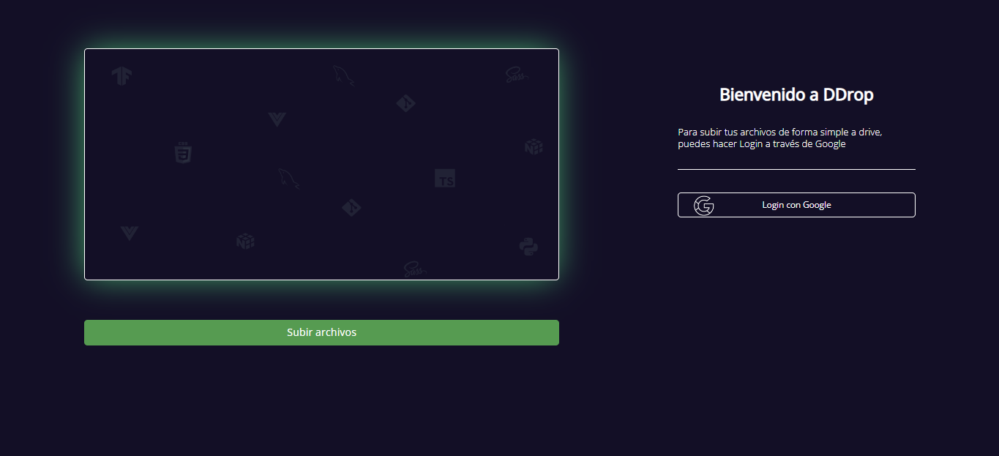
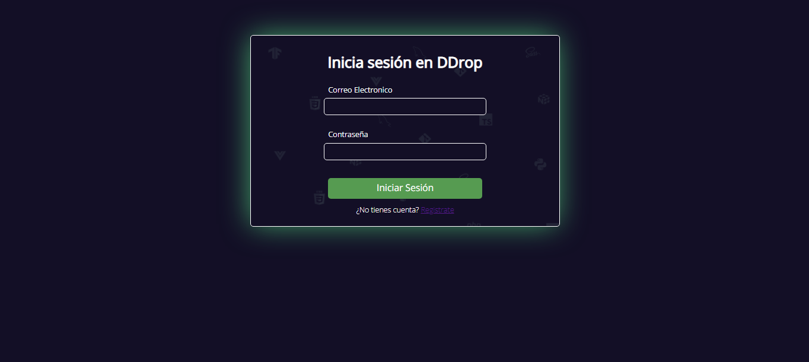
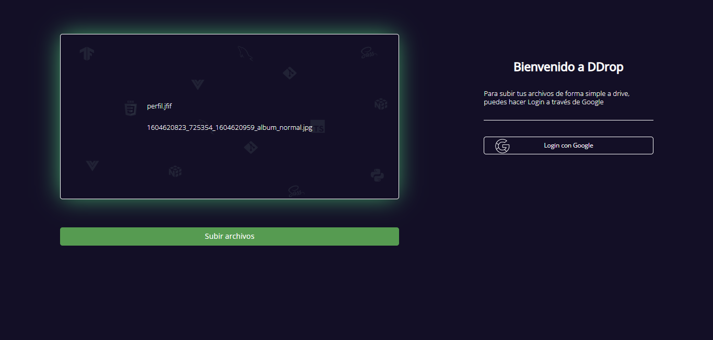
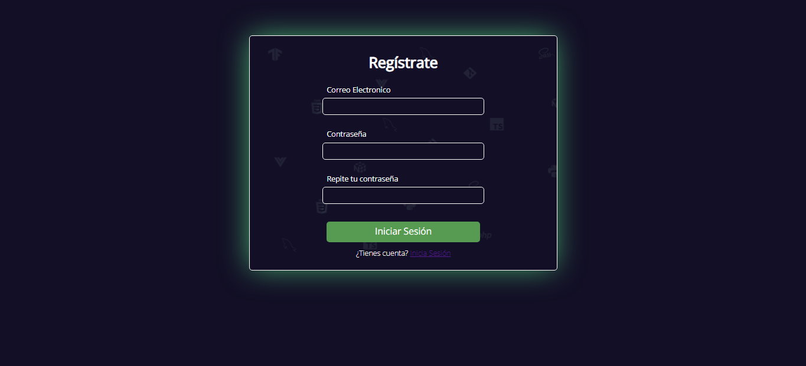

# Front-Hackathon-DropZone 
## Acceso al proyecto:
>https://raulvazpe.github.io/Front-Hackathon-DropZone/
## Descripción
Este es un proyecto front-end que se basa en crear una dropzone con JS
Para ello tenemos dos vistas creadas, login en las que nos redirigiran a la pagina principal (dropzone).
Podremos arrastrar archivos dentro de nuestra dropzone pero no todos serán compatibles, en el caso de que no sea una imagen nos aparecerá un error de formato.
Para subir los archivos unicamente deberemos tener la dropzone con archivos y pulsar el boton de "Subir archivos"
Justo al lado tendremos un boton por ahora sin funcionalidad, en el que serviría para subir los archivos a nuestro drive a traves de la api.

## Stack 

Para este proyecto he utilizado:
 ·JS vanilla
 ·HTML5
 ·CSS3
 ·Google Fonts

## Puntuación de Codefactor

## Contribución

Cualquier persona puede colaborar libremente con este proyecto

## Informacion de contacto

[Linkedin Raul Vazquez Pedrera](https://www.linkedin.com/in/raulvazquezpedrera/)

